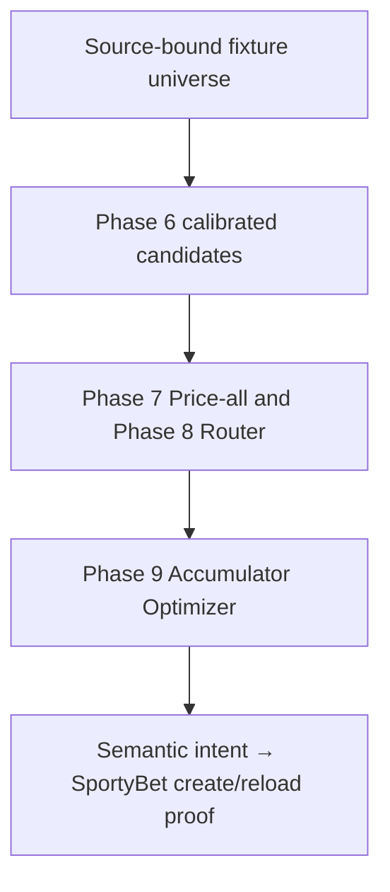

# Canonical ATHENA accumulator → SportyBet execution

PR #241 adds the one reviewed orchestration boundary for the user-facing
“build an ATHENA accumulator and give me the SportyBet booking code” workflow.
It composes the existing Phase 6 calibration, Phase 7 Price-all, Phase 8
Market Router, Phase 9 Accumulator Optimizer, reviewed SportyBet mapping, and
semantic share bridge. It does not replace any of those authorities.

## CURRENT_PIPELINE_GAP

Before this boundary, `build_acca.py` executed the legacy operational path:

```text
FotMob/OpenFootball → Database → AnalysisPipeline/MatchAnalyst
→ AccaFilter → legacy AccumulatorEngine → Kelly/report output
```

The latest main commit preserves live FotMob evidence in that path. Its
`_fetch_live_fixtures()` fetches FotMob fixtures, enriches future NS fixtures,
records `current_form_observed_at`, and syncs `fixture_extended`; the database
read then passes `current_home_form`, `current_away_form`, and
`current_form_observed_at` through `AnalysisPipeline` to `MatchAnalyst`, where
the current-form snapshot is scored and recorded. That evidence was not
issued as the exact `FixtureIntelligenceSnapshot`/Fixture State v2 ancestry
required by the newer decision stack.

The newer Price-all, Router, and Optimizer APIs previously stopped at their
individual in-memory results. They had no final semantic booking intent. The
SportyBet semantic bridge was independently invoked with caller-provided
semantic intents and then delegated native transport to the direct bridge.

The missing boundary was therefore a single source-replayed service that binds
the exact fixture intelligence/state, Phase 6 artifact and calibration unit,
reviewed SportyBet mapping and evidence-derived quote, Router decision, and
Optimizer leg; adapts only the final provider semantics; rechecks freshness;
and proves semantic equality across SportyBet create and reload before
returning a code. `build_acca.py` remains a compatibility analysis/report
surface and is explicitly non-authoritative for booking-code generation.

## Canonical call graph



The implementation is `domain/canonical_accumulator_execution.py`. Its public
builders are source-issued only:

- `CanonicalPhase6CandidateInput.from_phase6_calibration()` replays an exact
  reviewed Phase 6 artifact and calibration row. A caller boolean or arbitrary
  artifact SHA cannot authorize a candidate; unsupported Phase 6 units fail
  closed.
- `CanonicalAccumulatorFixtureInput.from_source_replayed_receipt()` rebuilds
  the exact user-controlled native inventory from evidence bytes, requires the
  full-UTC source bundle to carry that inventory, builds Fixture State v2 from
  one exact intelligence snapshot, replays the reconciliation receipt, and
  derives all quotes through the reviewed Price-all quote builder.
- `adapt_optimization_to_semantic_intents()` uses provider market/outcome
  labels and provider event team names from the reviewed mapping/reconciliation.
  It emits only `eventId`, expected team names, market name, outcome name, and
  exact specifier. Native market/outcome IDs and caller odds are absent.

The service calls `optimize_accumulator()` internally. That existing entry
point replays Router, which prices every candidate through Price-all before
choosing one opportunity per fixture. The service does not duplicate Router
or Optimizer logic.

## Ancestry and invariants

Every final fixture record retains the intelligence snapshot SHA, Fixture State
v2 SHA and field-evidence SHAs, reconciliation receipt SHA/identifier, native
inventory SHA, mapping SHA, full candidate ancestry (model/calibration/raw
probability identities), full quote ancestry (source, evidence snapshot,
observation time, odds, provider identity), and Optimizer identity.

The final result retains the selected Router decision IDs, Optimizer leg,
semantic intent, semantic resolution receipt, provider create receipt, provider
reload receipt, and exact semantic/native round-trip rows. The same event,
fixture, market, outcome, specifier, provider IDs, and source quote must be
present at each boundary.

Before a code is returned, these counts must be equal:

```text
final Router-backed selected legs
= Optimizer qualified legs
= semantic intents
= SportyBet create accepted selections
= SportyBet reload accepted selections
```

The Router selection count in the artifact is the count of Router decisions
backing the final Optimizer legs. `router_selection_pool_count` separately
records all Router-qualified opportunities, including reserves that were not
placed because of Optimizer caps. A drift, duplicate provider event, missing
leg, or semantic mismatch fails the whole execution; no leg is dropped or
replaced.

## Freshness and provider authority

The reviewed lite-HTML source contract explicitly leaves provider quote time
and provider snapshot ID unproven. This path does not manufacture either
capability. It derives decimal odds and the observation time from the exact
verified evidence/native inventory, uses the deterministic native-inventory
SHA as the evidence snapshot identity, and keeps `provider_snapshot_id=None`.
The source observation is user-attested evidence time, not a fabricated
provider timestamp. Evidence bytes, manifest, mapping, reconciliation, and
quote identities are replayed immediately before semantic execution. Missing,
future, stale, ambiguous, changed, or unavailable evidence fails closed.

The final gate also requires the current source-bound reconciliation to be
strictly ahead of the configured minimum lead window and the semantic bridge
to confirm the live provider event is pre-match, bookable, active, and an exact
human-readable match. The bridge derives native IDs from that current event;
they never become user intent authority.

The semantic bridge now parses the accepted provider event/outcome objects from
both create and reload. Native transport success alone is insufficient: the
provider market name, outcome name, team names, exact specifier, native IDs,
and odds must match the resolved semantic intent on both sides.

## Shortfall behavior

The requested fold count is a target, not a reason to relax a gate. If 20 is
requested and only 17 legs survive source freshness, Router, Optimizer,
portfolio caps, and semantic qualification, the result is
`NO_CODE_SHORTFALL` with `final_qualified_fold_count=17` and `shortfall=3`.
No weaker or “similar” legs are invented, and no misleading 20-fold code is
returned. A shortfall is written as a durable machine-readable artifact.

## Operational entry points

The canonical controlled runner is:

```text
python scripts/execute_canonical_accumulator.py \
  --factory module:callable \
  --output-dir .cache/athena-research/canonical-sportybet-accumulator
```

The reviewed factory must return exactly:

```python
{
    "fixture_inputs": tuple[CanonicalAccumulatorFixtureInput, ...],
    "target_size": int,
}
```

It cannot provide dates, a preselected slip, native IDs, odds, timestamps, or
snapshot IDs as authority. The generic manual workflow is
`.github/workflows/canonical-sportybet-accumulator.yml`; it uploads the durable
JSON artifact and never places a wager. Historic date-specific direct-share
workflows are retained only as clearly labelled research/proof surfaces.

`build_acca.py generate` and `build_acca.py quick` remain compatible legacy
analysis reports. They do not mint or authorize a SportyBet booking code.

## Frozen identities

| Contract | SHA-256 |
| --- | --- |
| Phase 7 Price-all | `1fb0a6c891adccd76b4864a6197e55d22154176a4191f57ce92cde13501535aa` |
| Phase 8 Market Router | `0e4486527b060109852ab56dd76774b2d150cf8326875e44537a3bce2dc656bf` |
| Phase 9 Accumulator Optimizer | `de6578c1a21370a1859901a73e4d3993d1544a66cb0f09384a45a8233a5ce253` |
| canonical market semantics | `b6a1de9415e27d9ed0e7394012435a60ca733187d41c951fd53d4a035ae84f11` |
| Fixture State field registry | `330e81a3fd8dc88c8fee98544d7f63e9d429c43c5d32ca761da5227e34de588a` |
| canonical execution v1 | `e4619cfa17e8e6adabd93317e4c76a34d0d82d5ac7ea66b5775f78130542f3d1` |

The canonical execution authority flags delegate pricing, routing, and
optimization to their reviewed contracts. Model, probability, calibration,
pricing, final selection, accumulator, production approval, staking, wallet,
login, cookies, and bet authority are not granted here. Every result has
`wager_placed: false`.

## Safety and current evaluation status

Only anonymous SportyBet share/create and reload transport is in scope. There
is no login, user cookie, wallet, stake, or wager operation. No real current
SportyBet execution is claimed by unit tests:

```text
REAL_CURRENT_CANONICAL_EXECUTION_STATUS =
NOT_RUN_VERIFIED_CURRENT_SPORTYBET_EXECUTION_CORPUS_UNAVAILABLE
```

Tests use frozen source evidence and mocked provider create/reload responses.
